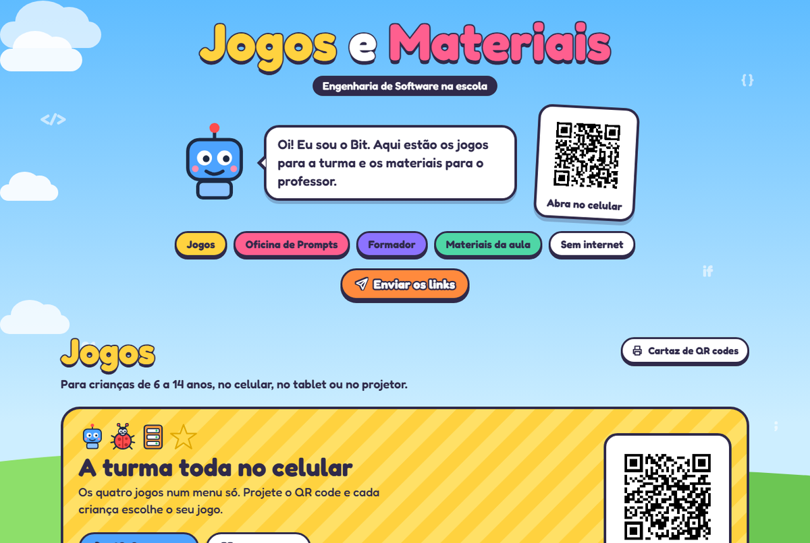

  

<h1 align="center">Jogos e Materiais · Engenharia de Software na escola</h1>

  Jogos para crianças de 6 a 14 anos e a Oficina de Prompts para professores, 
  feitos pelo curso de Engenharia de Software da UNIPAMPA, no Campus Alegrete.

  <a href="https://medeiros08.github.io/Jogo-ES/"><b>Abrir o site: medeiros08.github.io/Jogo-ES</b></a>

## Jogos

- **[Menu da turma](https://medeiros08.github.io/Jogo-ES/escola/)**: os quatro jogos num lugar só, para projetar o QR code e cada criança escolher o seu.
- **[Robô pega a estrela](https://medeiros08.github.io/Jogo-ES/robo/)**: monte as setas e leve o robô até a estrela. A partir de 6 anos.
- **[Ninja dos Bugs](https://medeiros08.github.io/Jogo-ES/ninja/)**: deslize para cortar os bugs, sem cortar o robô. A partir de 6 anos.
- **[Programação em Dupla](https://medeiros08.github.io/Jogo-ES/dupla/)**: um pilota o robô e o outro, que vê os bugs, mostra o caminho. A partir de 7 anos.
- **[Conecta o Sistema](https://medeiros08.github.io/Jogo-ES/conecta/)**: ligue o celular ao servidor e ao banco de dados. A partir de 8 anos.
- **[Arcade do Código](https://medeiros08.github.io/Jogo-ES/arcade/)**: três jogos rápidos com placar.
- **[Caça aos Bugs!](https://medeiros08.github.io/Jogo-ES/caca-bugs/)**: toque nos insetos em 30 segundos.

## Materiais da aula

- **[Certificado de Programador(a) Mirim](https://medeiros08.github.io/Jogo-ES/certificado/)**: escreva os nomes da turma e imprima, ou baixe em PDF.
- **[Slides da aula](https://medeiros08.github.io/Jogo-ES/slides/)**: dez telas para o projetor.
- **[Roteiro da aula](https://medeiros08.github.io/Jogo-ES/roteiro/)**: passo a passo de 50 minutos, em PDF.
- **[Folha de atividades](https://medeiros08.github.io/Jogo-ES/atividades/)**: três folhas por criança, em PDF.
- **[Mapas do navegador](https://medeiros08.github.io/Jogo-ES/mapas/)**: as 15 fases da Programação em Dupla para imprimir, em PDF.

## Oficina de Prompts para professores

- **[Oficina de Prompts](https://medeiros08.github.io/Jogo-ES/oficina/)**: a formação em quatro encontros.
- **[Construtor de prompts](https://medeiros08.github.io/Jogo-ES/prompt/)**: monte um pedido pronto para colar no Gemini.

Todos esses links são curtos e podem ser ditados ou escritos no quadro, por exemplo **medeiros08.github.io/Jogo-ES/ninja**.

## No celular

Aponte a câmera do celular para o QR code ao lado para abrir o site.

- Depois de abrir uma vez com internet, os jogos funcionam **mesmo sem internet**.
- Na página inicial, o botão **Instalar como app** coloca um ícone na tela do celular.
- Cada jogo e material tem um botão com **QR code grande** para projetar e para mandar pelo WhatsApp ou pelo Google Classroom.

## Créditos

O jogo Robô pega a estrela é de Paulo Severo ([paulosevero/robo-estrela](https://github.com/paulosevero/robo-estrela)). Os outros jogos seguem o mesmo estilo e também foram propostos para o repositório dele.

Este repositório guarda a versão publicada do site, no GitHub Pages.
